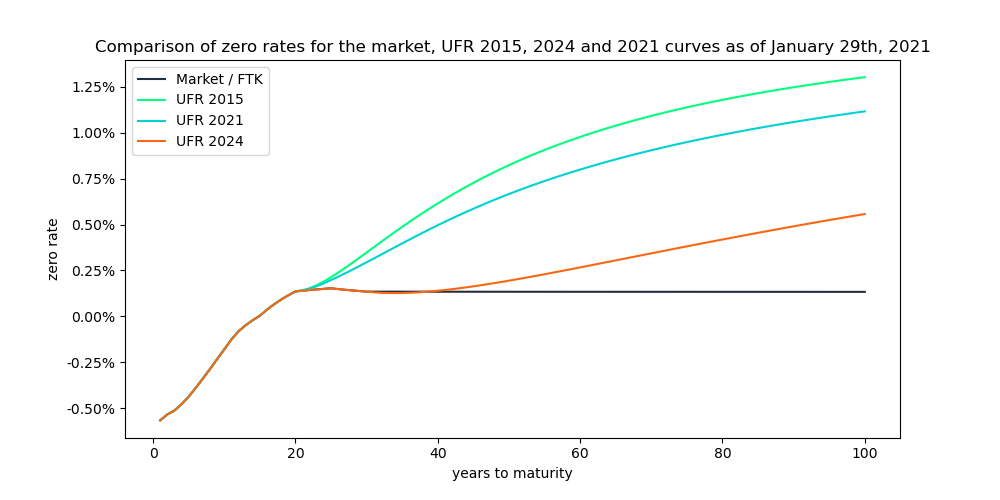
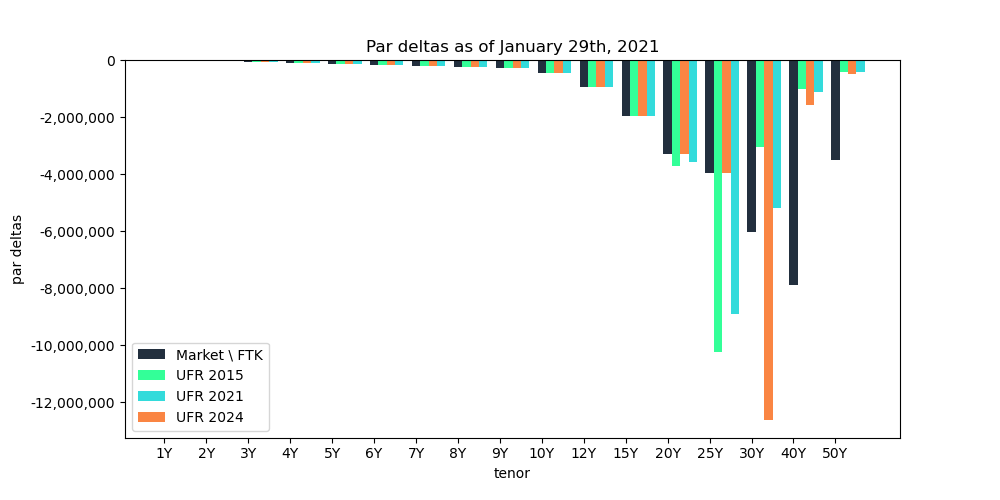

# Ultimate Forward Rate term structure example

Valuation and risk analytics examples in the DNB-FTK framework.

## Overview

This repository contains examples explaining how to build different flavours of the Dutch regulatory curve, and the associated risks, using the functionality from the open source library [QuantLib](https://www.quantlib.org/).

Examples are exposed purely for educational purposes.

For more info about the Dutch regulatory framework for pension funds visit the website of the [Dutch National Bank](https://www.dnb.nl/).

In case of questions or feedback contact us [via email](mailto:info@basispoint.io) or visit [our website](https://basispoint.io).

## Run Jupyter notebook

Click on the button below to run this notebook online.

## Used platforms

This repository relies on the [Binder](https://mybinder.readthedocs.io/en/latest/about.html) project, which is generously supported by [Google Cloud Platform](https://cloud.google.com/), [OVH](https://www.ovh.com/world/), [GESIS Notebooks](https://notebooks.gesis.org) and the [Turing Institute](https://www.turing.ac.uk).

## Used data

- Financial data ICE Benchmark Administration Limited (IBA), ICE Swap Rates, 12:00 P.M. (London Time), Based on Euros, retrieved from FRED, [Federal Reserve Bank of St. Louis](https://fred.stlouisfed.org/).

## License
This software is licensed under the Apache 2 license. See the [LICENSE](LICENSE) file for details.
