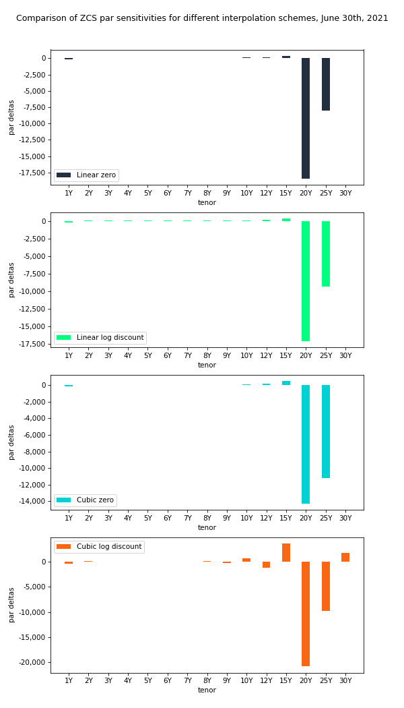

# Zero coupon swaps example

Valuation and risk analysis examples of zero coupon swaps.

## Overview

This directory contains examples demonstrating how to build, value and analyse the risks of zero coupon swaps using the open source library [QuantLib](https://www.quantlib.org/).

In case of questions or feedback contact us [via email](mailto:info@basispoint.io) or visit [our website](https://basispoint.io).

## Run Jupyter notebook

Click on the button below to run this notebook online.

## Used data

* Financial data ICE Benchmark Administration Limited (IBA), ICE Swap Rates, 12:00 P.M. (London Time), Based on Euros, retrieved from FRED, [Federal Reserve Bank of St. Louis](https://fred.stlouisfed.org/);
* [EMMI](https://www.emmi-benchmarks.eu/euribor-org/euribor-rates.html) interest rate benchmark fixings.